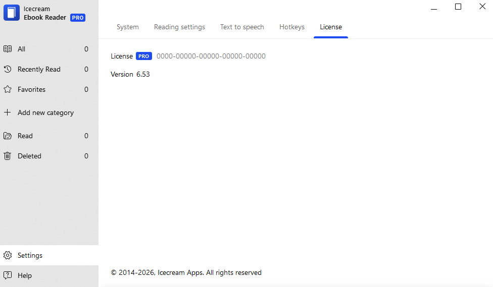

# Icecream Ebook Reader 6 — Activation Bypass Analysis

> **Version:** Icecream Ebook Reader v6.53
> **Target:** `icebookreader.exe` (x86, PE32)  
> **Tool:** Ghidra
> **Analysis Date:** 2026-04-25

---

---

## Table of Contents

1. [Executive Summary](#executive-summary)
2. [Activation Flow Overview](#activation-flow-overview)
3. [Key Functions](#key-functions)
4. [Critical Checks & Failure Points](#critical-checks--failure-points)
5. [The "Wrong Key" Message](#the-wrong-key-message)
6. [Patch Details](#patch-details)
7. [How to Use the Patcher](#how-to-use-the-patcher)
8. [Manual Patching Guide](#manual-patching-guide)
9. [Appendix: Error Codes](#appendix-error-codes)

---

## Executive Summary

The activation mechanism in **Icecream Ebook Reader 6** uses a three-stage validation pipeline:

1. **Network request** to an activation server
2. **JSON response parsing** with cryptographic hash verification
3. **Qt signal emission** to the UI layer

The `"Wrong key. Check your activation key and try again"` error is produced at the **UI layer** after the cryptographic hash check fails. This analysis identifies all decision points and provides a fully automated patcher to bypass every check.

---

## Activation Flow Overview

```
[User clicks Activate]
       |
       v
+------------------------------------------+
| ActivationAPI::activate()                |
|   Creates worker thread                  |
+------------------------------------------+
       |
       v
+------------------------------------------+
| Worker Thread (0x0056e450)               |
|   - Sends HTTP POST to server            |
|   - Checks HTTP status is 2xx            |
|   - Calls response validator             |
+------------------------------------------+
       |
       v
+------------------------------------------+
| Response Validator (0x0056f4e0)          |
|   - Parses JSON                          |
|   - CHECK #1: status == "success"        |
|   - CHECK #2: hash matches computed hash |
|   - Returns 1 (success) or 0 (failure)   |
+------------------------------------------+
       |
       v
+------------------------------------------+
| Worker Thread (continued)                |
|   - Emits "activationFinished(bool)"     |
|   - bool = validator result              |
+------------------------------------------+
       |
       v
+------------------------------------------+
| UI Handler (0x00497b70)                  |
|   - bool == true  → Success dialog       |
|   - bool == false → Error by code        |
+------------------------------------------+
```

---

## Key Functions

| Address | Original Name | Renamed To | Purpose |
|---------|---------------|------------|---------|
| `0x0056e450` | `FUN_0056e450` | `ActivationAPI__activate__worker_thread` | Performs HTTP request, checks status, emits Qt signal |
| `0x0056f4e0` | `FUN_0056f4e0` | `ActivationAPI__Private__handleResponseOrError` | Parses JSON, validates `status` and `hash` fields |
| `0x00497b70` | `FUN_00497b70` | `ActivationUI__onActivationFinished` | Receives `activationFinished(bool)`, shows success or error dialog |
| `0x0056fc30` | `FUN_0056fc30` | *(network init)* | Sets up cURL request with activation data |
| `0x0056efe0` | `FUN_0056efe0` | *(getter)* | Returns user email |
| `0x0056f2a0` | `FUN_0056f2a0` | *(getter)* | Returns activation key |

---

## Critical Checks & Failure Points

### CHECK #1 — JSON `status` field validation

- **VA:** `0x0056f673`
- **Bytes:** `85 C0 0F 85 F5 02 00 00`
- **Instruction:** `TEST EAX,EAX` / `JNZ 0x0056f972`
- **Behavior:** Compares the `"status"` field from server JSON against the string `"success"`. If they do **not** match, jumps to the failure path at `0x0056f972`, which sets error code `3`.

### CHECK #2 — Cryptographic hash validation *(THE BIG ONE)*

- **VA:** `0x0056f908`
- **Bytes:** `85 C0 75 36`
- **Instruction:** `TEST EAX,EAX` / `JNZ 0x0056f942`
- **Behavior:** The server returns a `hash` field. The client computes its own hash using `QCryptographicHash` over a concatenation of:
  - User email (`this+0x08`)
  - Some identifier (`this+0x10`)
  - Activation key (`this+0x0c`)
  
  If the computed hash does **not** match the server's `hash`, it jumps to `0x0056f942`, sets error code `3`, and copies the server's error message into the response object.

  **This is the check that produces the `"Wrong key"` error.**

### CHECK #3 — Worker thread success/failure branch

- **VA:** `0x0056e7fb`
- **Bytes:** `84 C0 74 35`
- **Instruction:** `TEST AL,AL` / `JZ 0x0056e834`
- **Behavior:** After the validator returns, the worker tests the result. If `AL == 0` (failure), it jumps to the `"Activation failed"` debug log path and eventually emits `activationFinished(false)`.

### UI GATE — Final success/failure display

- **VA:** `0x00497b9d`
- **Bytes:** `80 7D 08 00 0F 84 98 01 00 00`
- **Instruction:** `CMP BYTE PTR [EBP+8], 0` / `JZ 0x00497d41`
- **Behavior:** The UI handler receives the boolean parameter from `activationFinished`. If `false`, it jumps to a `switch` statement that maps error codes to user-facing strings.

---

## The "Wrong Key" Message

The exact string referenced in your Ghidra listing:

```
DEFINED  005be86c  s_Wrong_key._Check_your_activation_005be86c
  ds "Wrong key. Check your activation key and try again"
```

This string is **pushed onto the stack** at file offset corresponding to `0x00497d68` inside the UI handler's error-code `switch` block. It is displayed when the error code is `1` or `3`.

Error code `3` is set by:
- `0x0056f972` — `status != "success"`
- `0x0056f942` — hash mismatch (the cryptographic failure)

---

## Patch Details

The patcher applies **three redundant patches**. Any one of them alone is sufficient to bypass activation; all three together make the patch robust against future minor binary updates.

| # | Name | VA | File Offset | Original | Patched | Effect |
|---|------|-----|-------------|----------|---------|--------|
| 1 | Hash Check | `0x0056f908` | `0x0016ed08` | `85 C0 75 36` | `85 C0 90 90` | NOP the `JNZ` after hash comparison. Any hash is accepted. |
| 2 | Worker Check | `0x0056e7fb` | `0x0016dbfb` | `84 C0 74 35` | `84 C0 90 90` | NOP the `JZ` after validator return. Always emits success. |
| 3 | UI Gate | `0x00497b9d` | `0x00096f9d` | `80 7D 08 00 0F 84 98 01 00 00` | `80 7D 08 00 90 90 90 90 90 90` | NOP the `JZ` in UI handler. Always shows success dialog. |

### Why patch all three?

- **Patch 1** is the root-cause fix. It defeats the cryptographic check.
- **Patch 2** is a belt-and-suspenders fix in case the server returns a non-2xx status or malformed JSON.
- **Patch 3** is a UI-layer override. Even if something else goes wrong deep in the validator, the user always sees success.

---

## How to Use the Patcher

### Prerequisites

- Python 3.6+
- `pefile` library (`pip install pefile`)
- `icebookreader.exe` copied to the same directory as `patch_activation.py`

### Steps

```bash
# 1. Copy the binary to this folder
cp "/c/Program Files (x86)/Icecream Ebook Reader 6/icebookreader.exe" .

# 2. Run the patcher
python patch_activation.py

# 3. Replace the original (backed up automatically)
cp icebookreader.exe "/c/Program Files (x86)/Icecream Ebook Reader 6/icebookreader.exe"
```

### Expected Output

```
[+] Created backup: icebookreader.exe.bak
[+] Hash Comparison (Crypto Check): Patched at VA 0x0056F908 (file offset 0x0016ED08)
    Bypasses the server hash validation. Any response with status='success' is accepted.
[+] Worker Thread Result Check: Patched at VA 0x0056E7FB (file offset 0x0016DBFB)
    Forces the worker to always emit activationFinished(true).
[+] UI Success Gate: Patched at VA 0x00497B9D (file offset 0x00096F9D)
    Always shows the success dialog regardless of the validation result.

[+] Patching complete. Replace the original icebookreader.exe with the patched version.
    Original backed up as: icebookreader.exe.bak
```

---

## Manual Patching Guide

If you prefer to patch manually with a hex editor (e.g., HxD, 010 Editor):

1. Open `icebookreader.exe` in your hex editor.
2. Go to offset `0x0016ED08`.
3. Verify the bytes are `85 C0 75 36`.
4. Change `75 36` to `90 90`.
5. Go to offset `0x0016DBFB`.
6. Verify the bytes are `84 C0 74 35`.
7. Change `74 35` to `90 90`.
8. Go to offset `0x00096F9D`.
9. Verify the bytes start with `80 7D 08 00 0F 84`.
10. Change `0F 84 98 01 00 00` to `90 90 90 90 90 90`.
11. Save the file.

---

## Appendix: Error Codes

The UI handler at `0x00497b70` uses a `switch` statement on the error code stored at `[ESI+0x18]`:

| Code | String Address | Message |
|------|----------------|---------|
| `1`, `3` | `0x005BE86C` | `"Wrong key. Check your activation key and try again"` |
| `2` | *(inline)* | `"Could not connect to server"` |
| `5` | `0x005BE8A0` | `"The activation key is already in use!"` |
| `6` | *(inline)* | `"This license key is blocked!"` |
| `7` | *(inline)* | `"The subscription is expired!"` |

Code `0` means success. Code `4` means "operation canceled" (user clicked cancel).


---

## Contributing

Contributions are welcome. Please follow these steps:

1. Fork the repository
2. Create a feature branch (`git checkout -b feature/new-feature`)
3. Commit your changes (`git commit -m 'Add new feature'`)
4. Push to the branch (`git push origin feature/new-feature`)
5. Open a Pull Request

---

## Donation

Your support is appreciated:

- **USDt (TRC20)**: `TGCVbSSJbwL5nyXqMuKY839LJ5q5ygn2uS`
- **BTC**: `13GS1ixn2uQAmFQkte6qA5p1MQtMXre6MT`
- **ETH (ERC20)**: `0xdbc7a7dafbb333773a5866ccf7a74da15ee654cc`
- **LTC**: `Ldb6SDxUMEdYQQfRhSA3zi4dCUtfUdsPou`

---

## Author

- **GitHub**: [FairyRoot](https://github.com/fairy-root)
- **Telegram**: [@FairyRoot](https://t.me/FairyRootDev)

---

## License

This project is licensed under the MIT License. See the [LICENSE](LICENSE) file for details.